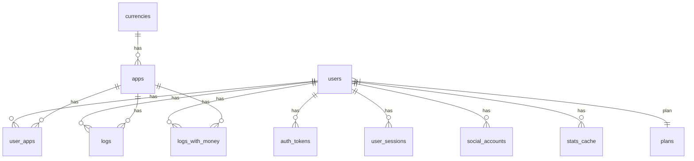

# PullLog Backend
個人のガチャ履歴を記録・管理するWebアプリ「PullLog」のバックエンドリポジトリです。  
バックエンドはAPIエントリポイントとしてフロントエンドとデータベースとのデータの中継を担います。  
本アプリの正式版は Laravel + PostgreSQL を中心技術として構築します。  
初期開発用のモック環境としては [MockAPI-PHP](https://github.com/ka215/MockAPI-PHP) を使用しています。

---

## 目次

- [主な特徴](#主な特徴)
- [技術スタック](#技術スタック)
- [テーブル構成](#テーブル構成)
- [ER図](#ER図)
- [デプロイ手順](#デプロイ手順)
- [バッチ処理について](#バッチ処理について)
- [モック環境](#モック環境)
- [ライセンス](#ライセンス)
- [コントリビューション](#コントリビューション)
- [関連リンク](#関連リンク)

---

## 主な特徴

- エンドポイントのリクエストに対してJSONレスポンスを応答する
- リクエスト毎のトークン認証・データベース処理
- 現状は管理画面等のUI（View）はなし
- レスポンスは OpenAPI のスキーマに準拠（~~スキーマ駆動型実装~~)

---

## 技術スタック

- **PHP**: PHP v8.3 (開発環境は v8.4.2)
- **フレームワーク**: Laravel v12.20.0
- **データベース**: PostgreSQL v14.13 (開発環境は v17.4)
- ~~**OpenAPI 連携**: openapi-generator-cli v7.14.0 (※ 要JDK v11.x以上)~~
- **モック環境**: MockAPI-PHP v1.3.1
- **画像変換**: Intervention Image v3.11.4 (driver: GD)
- **メール送信（開発用）**: mailtrap

---

## テーブル構成

テーブルの並びはマイグレーション順になっています。

| テーブル名     | 用途・説明           | 主なカラム                                                         |
|----------------|----------------------|--------------------------------------------------------------------|
| `plans`        | 契約プラン管理       | id (PK), name, max_apps, ...                                       |
| `users`        | ユーザー管理         | id (PK), email (UQ), roles, plan_id (FK), ...                      |
| `currencies`   | 通貨マスタ           | code (PK), name, minor_unit, rounding, ...                         |
| `apps`         | アプリケーション管理 | id (PK), app_key (UQ), currency_code (FK), ...                     |
| `user_apps`    | ユーザー・アプリPivot | id (PK), user_id (FK), app_id (FK), [user_id, app_id] (UQ), ...   |
| `auth_tokens`  | 認証トークン管理     | id (PK), user_id (FK), token (UQ), type, ...                       |
| `user_sessions`| ユーザーセッション（CSRFトークン）管理 | csrf_token (PK), user_id (FK), email, ...        |
| `stats_cache`  | 統計データ（キャッシュ）管理 | cache_key (PK), user_id (FK), value, ...                   |
| `logs`         | 日次ログ（履歴）管理 | [user_id, id] (PK), user_id (FK), app_id (FK), [user_id, app_id, log_date] (UQ), ... |
| `logs_with_money` | 日次ログView（読込専用） | VIEW: logs JOIN apps JOIN currencies   |

> **注**:  
> - (PK) = 主キー  
> - (UQ) = ユニーク制約  
> - (FK) = 外部キー  
> - 各テーブルの詳細設計や全カラム・型は [pulllog-ddl.sql](https://github.com/magicmethods/pulllog-backend/blob/main/pulllog-ddl.sql) を参照

※ logs テーブルはパーティション化（ `hash partitioned by user_id` ）してあり、子テーブルとして `logs_p0` ～ `logs_p9` を持ちます。ただし、 Laravel/Eloquent からのアクセスは常に代表テーブルの logs に集約します。  
※ pulllog-ddl.sql はあくまでスキーマ確認用です。手動DDLとして使用するのは**非推奨**です。原則、DBマイグレーションは Laravel の `artisan maigrate` を使いますが、パーティション化する logs テーブルのみは専用のDDLを使ってマイグレーションします。

---

## ER図

主要なエンティティ（テーブル）とリレーションの概要図です。  
属性値まで含む詳細ER図は [pulllog-ER.md](https://github.com/magicmethods/pulllog-backend/blob/main/pulllog-ER.md) をご覧ください。



---

## デプロイ手順

1. Gitからリソースを取得  
  例:
  ```bash
  cd /var/www
  sudo git clone https://github.com/magicmethods/pulllog-backend.git pulllog-backend
  sudo chown -R deploy:www-data pulllog-backend
  cd pulllog-backend
  ```
2. .envファイルの設置
  - `.env.example` をコピーし、本番用に編集。
  - データベース情報、APP_KEY、APP_ENV=production、キャッシュ、メール設定等を正しくセット。
  - `php artisan key:generate` でAPP_KEYを生成。
  - `php artisan tinker` でAPI_KEYを生成（下記の例を参照）。
    ```php
    > 'PLGv*:'.bin2hex(random_bytes(32))
    = "PLGv*:cb59588095adba014a886ab7d7984699a3213ee210f0e00cfb55907c040637da"
    ```
3. Composer依存のインストール
  ```bash
  composer install --no-dev --optimize-autoloader
  ```
4. パーミッション設定  
  例:
  ```bash
  sudo chown -R deploy:www-data storage bootstrap/cache
  sudo chmod -R 775 storage bootstrap/cache
  ```
5. DBマイグレーション  
  必ず Laravel のマイグレーション後に DDL で **ログテーブル作成→パーティション化→View作成** を行う。
  ```bash
  php artisan migrate:fresh --seed
  psql -U <username> -d <dbname> -f create_logs_tables.sql
  ```
6. キャッシュ/設定の最適化
  ```bash
  php artisan config:cache
  php artisan route:cache
  php artisan view:cache
  php artisan event:cache
  ```
7. Webサーバ設定
  - Nginxの例:
  ```nginx
  server {
    listen 80;
    server_name pulllog.net;
    root /var/www/pulllog-backend/public;

    index index.php index.html;

    location / {
      try_files $uri $uri/ /index.php?$query_string;
    }

    location ~ \.php$ {
      fastcgi_pass unix:/var/run/php/php8.2-fpm.sock;
      fastcgi_index index.php;
      include fastcgi_params;
      fastcgi_param SCRIPT_FILENAME $document_root$fastcgi_script_name;
    }

    location ~* \.(js|css|png|jpg|jpeg|gif|ico)$ {
      expires max;
      log_not_found off;
    }
  }
  ```
  - Apacheの例:
  ```
  <VirtualHost *:80>
    ServerName pulllog.net
    DocumentRoot /var/www/pulllog-backend/public

    <Directory /var/www/pulllog-backend/public>
      AllowOverride All
      Require all granted
      Options -Indexes
    </Directory>

    ErrorLog ${APACHE_LOG_DIR}/pulllog-error.log
    CustomLog ${APACHE_LOG_DIR}/pulllog-access.log combined
  </VirtualHost>
  ```
  - Coreserverでのホスティング時:
  ```bash
  cd ~/public_html/api.pulllog.net
  ln -s ../pulllog-backend/stable/public v1
  ln -s ../pulllog-backend/stable/storage/app/public storage
  touch .htaccess
  vim .htaccess
  ```
  .htaccessで /api/v1/ で始まるURLを /v1/api/v1/ 以下へ内部リダイレクト
  ```
  RewriteEngine On

  RewriteCond %{REQUEST_FILENAME} !-f
  RewriteCond %{REQUEST_FILENAME} !-d
 
  RewriteRule ^api/v1/(.*)$ v1/api/v1/$1 [L]
  ```
8. 動作確認
  https://api.pulllog.net/api/v1/dummy にアクセスしてJSONレスポンスが返却されればOk。

---

## バッチ処理について

**運用サマリ**  
- 実行内容: DBフルバックアップ＋日次サマリ（ユーザー/アプリ集計）
- 実行時刻: 毎日 03:30 JST（本番環境のみスケジュール実行）
- 保存場所: storage/app/backups/YYYYMMDD/, storage/app/reports/YYYYMMDD/
- 通知: 成功/失敗を `BATCH_NOTIFY_EMAIL` へメール

**依存コマンド/要件**  
- pg_dump（PostgreSQL クライアント）、gzip、openssl
- Windows の場合は `PG_DUMP_PATH` に `pg_dump.exe` のフルパスを設定（例: `C:\Program Files\PostgreSQL\16\bin\pg_dump.exe`）

**環境変数**  
- PG_DUMP_PATH（例: `pg_dump`）/ BACKUP_ENCRYPTION_KEY（未設定なら暗号化スキップ）
- RETENTION_DAYS（既定 `14`）/ REPORT_TOP_N（既定 `10`）
- BATCH_NOTIFY_EMAIL（既定 `admin@pulllog.net`）
- メール送信には `.env` の `MAIL_*` を実配送向けに設定（既定 `MAIL_MAILER=log` はログ出力のみ）

**スケジュール設定**  
- 本番のみ有効。サーバ側は「毎分」Cronで `Laravel` スケジューラを起動してください。
- 例（Linux）: `* * * * * cd /path/to/backend/stable && php artisan schedule:run >> storage/logs/schedule.log 2>&1`
- 稼働確認: `php artisan schedule:list`

**手動実行/ドライラン**  
- バックアップ: `php artisan db:backup --dry-run`（実行時は `--dry-run` を外す）
- サマリ: `php artisan report:daily-summary --dry-run`

**保持/保存ポリシー**  
- `RETENTION_DAYS` を経過した日付フォルダ（YYYYMMDD）は自動削除
- バックアップは `*.dump.gz`（暗号化時は `*.dump.gz.enc`）

**復旧手順（例）**  
- 暗号化あり: `openssl enc -d -aes-256-cbc -pbkdf2 -pass pass:"$BACKUP_ENCRYPTION_KEY" -in file.dump.gz.enc -out file.dump.gz`
- 復号後: `gunzip file.dump.gz && pg_restore -d <DB_NAME> -Fc file.dump`
- 暗号化なし: `gunzip file.dump.gz && pg_restore -d <DB_NAME> -Fc file.dump`

**運用・監視**  
- 成功/失敗の概要をメール通知。詳細は `storage/logs/laravel.log` を参照
- 容量監視を推奨（`storage/app` の残容量必須）。大容量時は実行時間帯の見直しも検討

**セキュリティ注意**  
- `BACKUP_ENCRYPTION_KEY` は十分な強度で生成し `.env` にのみ保存する
- キー変更後は旧バックアップの復号に旧キーが必要なため、保持期間（既定14日）が過ぎるまで旧キーは保管する
- `.env` とバックアップファイル（特に `.enc` の鍵）はリポジトリに含めないこと

**付記: `BACKUP_ENCRYPTION_KEY` の生成方法**  
以下のいずれかで十分に強い乱数パスフレーズ（32バイト以上）を生成し、`.env` に設定する（base64 形式推奨）。
- Linux/macOS（OpenSSL）
    - `openssl rand -base64 32`
    - 16進が良ければ: `openssl rand -hex 32`
- Windows（PowerShell）
    - OpenSSLがある場合: `openssl rand -base64 32`
    - .NETの暗号APIを使用:
        - `$b = New-Object byte[] 32; (New-Object System.Security.Cryptography.RNGCryptoServiceProvider).GetBytes($b);`
[Convert]::ToBase64String($b)
- PHP（どこでも実行可）
    - `php -r "echo base64_encode(random_bytes(32)), PHP_EOL;"`

`.env` への設定例  
- 値に記号が含まれても安全に扱えるよう、引用を推奨
- `BACKUP_ENCRYPTION_KEY='Qb6q8mQ2Zp9...（生成値）...'`

動作テスト（任意）  
- 暗号化: `echo test > /tmp/t && openssl enc -aes-256-cbc -pbkdf2 -salt -pass pass:"$BACKUP_ENCRYPTION_KEY" -in /tmp/t -out /tmp/t.enc`
- 復号: `openssl enc -d -aes-256-cbc -pbkdf2 -pass pass:"$BACKUP_ENCRYPTION_KEY" -in /tmp/t.enc -out /tmp/t.dec && diff /tmp/t /tmp/t.dec`

---

## モック環境

モックシステムは `beta/` ディレクトリに格納しています。
稼働するにはPHPの実行環境下にて `beta/` へ移動後、下記のコマンドを実行してください。  
※ PHPが稼働中のサーバ環境の場合、簡易サーバ起動は不要です。

```bash
composer install

php ./start_server.php
```

PHPの簡易サーバが起動すると `http://localhost:3030/beta` をバックエンドのAPIサーバとして利用できます。  
フロントエンド側の `.env.local` にて、バックエンドAPIのURLをモック側に指定してから `pnpm dev` を実行してください。

```env
API_BASE_URL=http://localhost:3030/beta
```

※ モック環境ではメール認証系の処理を省略してあるため、アカウント登録時等にメール送信が行われません。

---

## ライセンス

MAGIC METHODS に帰属します。

---

## コントリビューション

関係各位のPull Request・Issue歓迎です。
設計や方針の議論はDiscussionsまたはIssueで行ってください。

---

## 関連リンク

- [PullLog フロントエンドリポジトリ](https://github.com/magicmethods/pulllog-frontend)
- [PullLog API仕様書](https://github.com/magicmethods/pulllog-contract)
- ドキュメント

