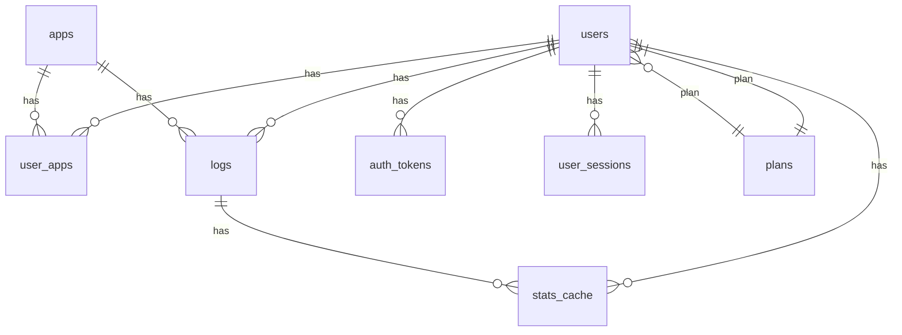

# PullLog Backend
個人のガチャ履歴を記録・管理するWebアプリ「PullLog」のバックエンドリポジトリです。  
バックエンドはAPIエントリポイントとしてフロントエンドとデータベースとのデータの中継を担います。  
本アプリの正式版は Laravel + PostgreSQL を中心技術として構築します。  
初期開発用のモック環境としては [MockAPI-PHP](https://github.com/ka215/MockAPI-PHP) を使用しています。

---

## 目次

- [テーブル構成](#テーブル構成)
- [ER図](#ER図)
- [モック環境](#モック環境)
- [ライセンス](#ライセンス)
- [コントリビューション](#コントリビューション)
- [関連リンク](#関連リンク)

---

## テーブル構成

| テーブル名     | 用途・説明           | 主なカラム                                                         |
|----------------|----------------------|--------------------------------------------------------------------|
| `plans`        | 契約プラン管理       | id (PK), name, max_apps, ...                                       |
| `users`        | ユーザー管理         | id (PK), email (UQ), roles, plan_id (FK), ...                      |
| `apps`         | アプリケーション管理 | id (PK), app_key (UQ), name, ...                                   |
| `user_apps`    | ユーザー・アプリ管理（リレーション） | id (PK), user_id (FK), app_id (FK), ...            |
| `logs`         | 日次ログ（履歴）管理 | id (PK), user_id (FK), app_id (FK), log_date, total_pulls, ...     |
| `auth_tokens`  | 認証トークン管理     | id (PK), user_id (FK), token (UQ), type, ...                       |
| `user_sessions`| ユーザーセッション（CSRFトークン）管理 | csrf_token (PK), user_id (FK), email, ...        |
| `stats_cache`  | 統計データ（キャッシュ）管理 | cache_key (PK), user_id (FK), value, ...                   |

> **注**:  
> - (PK) = 主キー  
> - (UQ) = ユニーク制約  
> - (FK) = 外部キー  
> - 各テーブルの詳細設計や全カラム・型は [pulllog-ddl.sql](https://github.com/magicmethods/pulllog-backend/blob/main/pulllog-ddl.sql) を参照

---

## ER図

主要なエンティティ（テーブル）とリレーションの概要図です。  
属性値まで含む詳細ER図は [pulllog-ER.md](https://github.com/magicmethods/pulllog-backend/blob/main/pulllog-ER.md) をご覧ください。



---

## モック環境

モックシステムは `beta/` ディレクトリに格納しています。
稼働するにはPHPの実行環境下にて `beta/` へ移動後、下記のコマンドを実行してください。

```bash
composer install

php ./start_server.php
```

PHPの簡易サーバが起動すると `http://localhost:3030/beta` をバックエンドのAPIサーバとして利用できます。  
フロントエンド側の `.env.local` にて、バックエンドAPIのURLをモック側に指定してから `pnpm dev` を実行してください。

```env
API_BASE_URL=http://localhost:3030/beta
```

※ モック環境ではメール認証系の処理を省略してあるため、アカウント登録時等にメール送信が行われません。

---

## ライセンス

MAGIC METHODS に帰属します。

---

## コントリビューション

関係各位のPull Request・Issue歓迎です。
設計や方針の議論はDiscussionsまたはIssueで行ってください。

---

## 関連リンク

- [PullLog フロントエンドリポジトリ](https://github.com/magicmethods/pulllog-frontend)
- [PullLog API仕様書](https://github.com/magicmethods/pulllog-contract)
- ドキュメント

