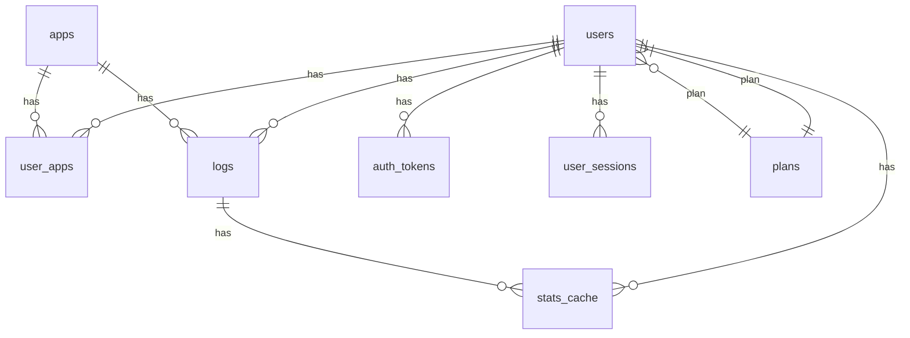

# PullLog Backend
個人のガチャ履歴を記録・管理するWebアプリ「PullLog」のバックエンドリポジトリです。  
バックエンドはAPIエントリポイントとしてフロントエンドとデータベースとのデータの中継を担います。  
本アプリの正式版は Laravel + PostgreSQL + SQLite を中心技術として構築します。初期開発用のモック環境としては MockAPI-PHP を使用します。

---

## 目次

- [ER図](#ER図)
- [モック環境](#モック環境)
- [ライセンス](#ライセンス)
- [コントリビューション](#コントリビューション)
- [関連リンク](#関連リンク)

---

## ER図

ここではエンティティ（テーブル）ベースの概要図まで。  
属性値までついた詳細なER図は[pulllog-ER.md](https://github.com/magicmethods/pulllog-backend/blob/main/pulllog-ER.md)を参照してください。



---

## モック環境

モックシステムは `beta/` ディレクトリに格納しています。
稼働するにはPHPの実行環境下にて `beta/` へ移動後、下記のコマンドを実行してください。

```bash
composer install

php ./start_server.php
```

PHPの簡易サーバが起動すると `http://localhost:3030/beta` をバックエンドのAPIサーバとして利用できます。  
フロントエンド側の `.env.local` にて、バックエンドAPIのURLをモック側に指定してから `pnpm dev` を実行してください。

```env
API_BASE_URL=http://localhost:3030/beta
```

※ モック環境ではメール認証系の処理を省略してあるため、アカウント登録時等にメール送信が行われません。

---

## ライセンス

MAGIC METHODS に帰属します。

---

## コントリビューション

関係各位のPull Request・Issue歓迎です。
設計や方針の議論はDiscussionsまたはIssueで行ってください。

---

## 関連リンク

- [PullLog フロントエンドリポジトリ](https://github.com/magicmethods/pulllog-frontend)
- [PullLog API仕様書](https://github.com/magicmethods/pulllog-contract)
- ドキュメント

