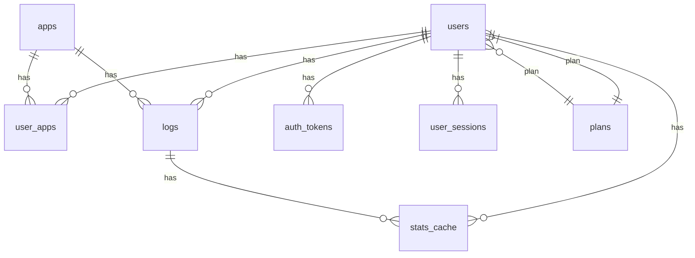
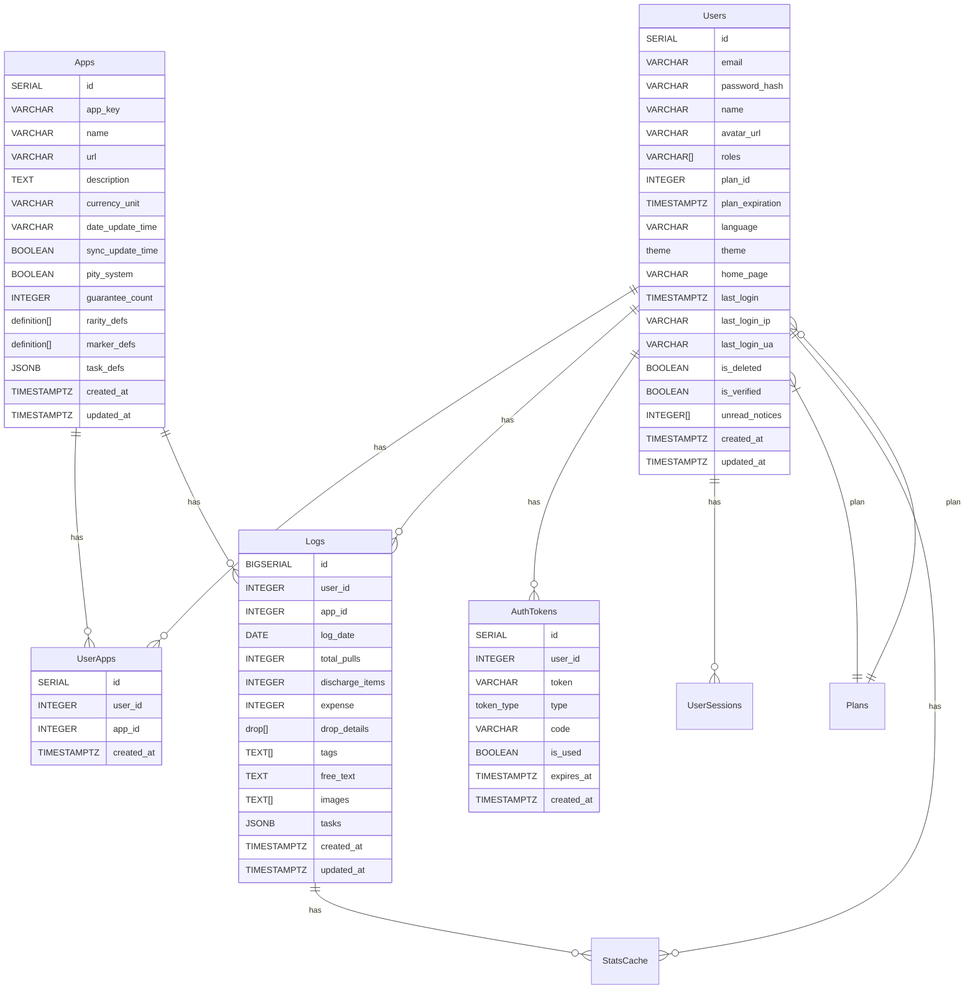
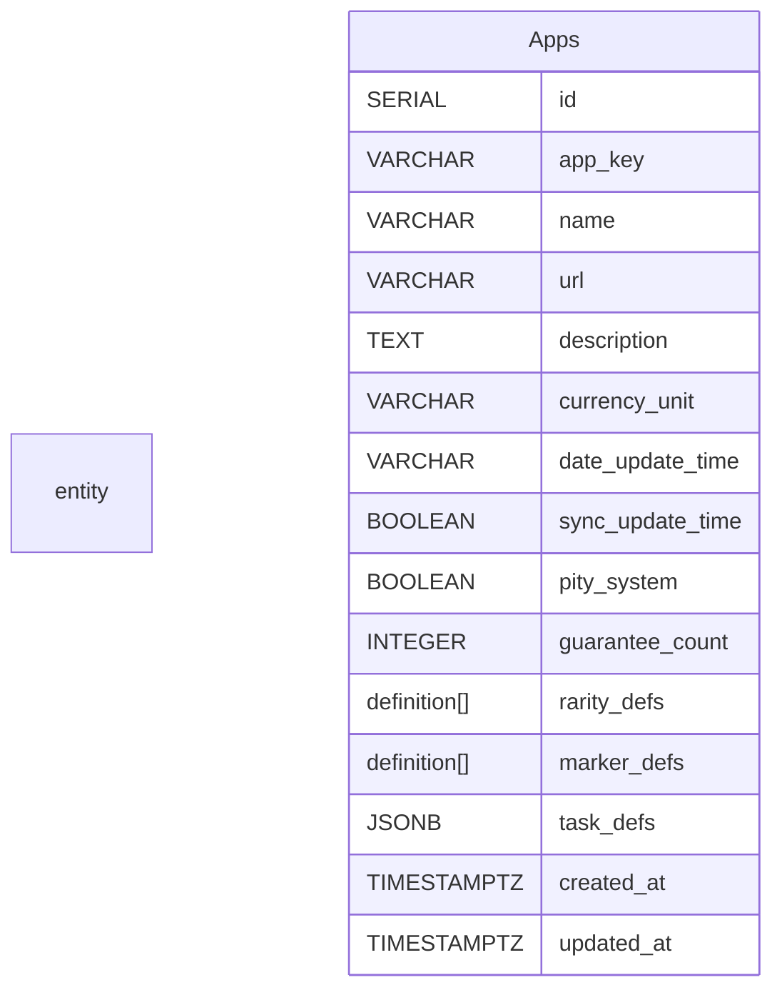

# PullLog ER







```mermaid
erDiagram
    entity UserSessions {
        VARCHAR csrf_token PK
        INTEGER user_id FK
        VARCHAR email
        TIMESTAMPTZ created_at
        TIMESTAMPTZ expires_at
    }
    entity StatsCache {
        user_id
        cache_key
        value
        created_at
        updated_at
    }
    entity Plans {
        SERIAL id PK
        VARCHAR name UNIQUE
        TEXT description
        INTEGER max_apps
        INTEGER max_app_name_length
        INTEGER max_app_desc_length
        INTEGER max_log_tags
        INTEGER max_log_tag_length
        INTEGER max_log_text_length
        INTEGER max_logs_per_app
        INTEGER max_storage_mb
        INTEGER price_per_month
        BOOLEAN is_active
        TIMESTAMPTZ created_at
        TIMESTAMPTZ updated_at
    }
```
