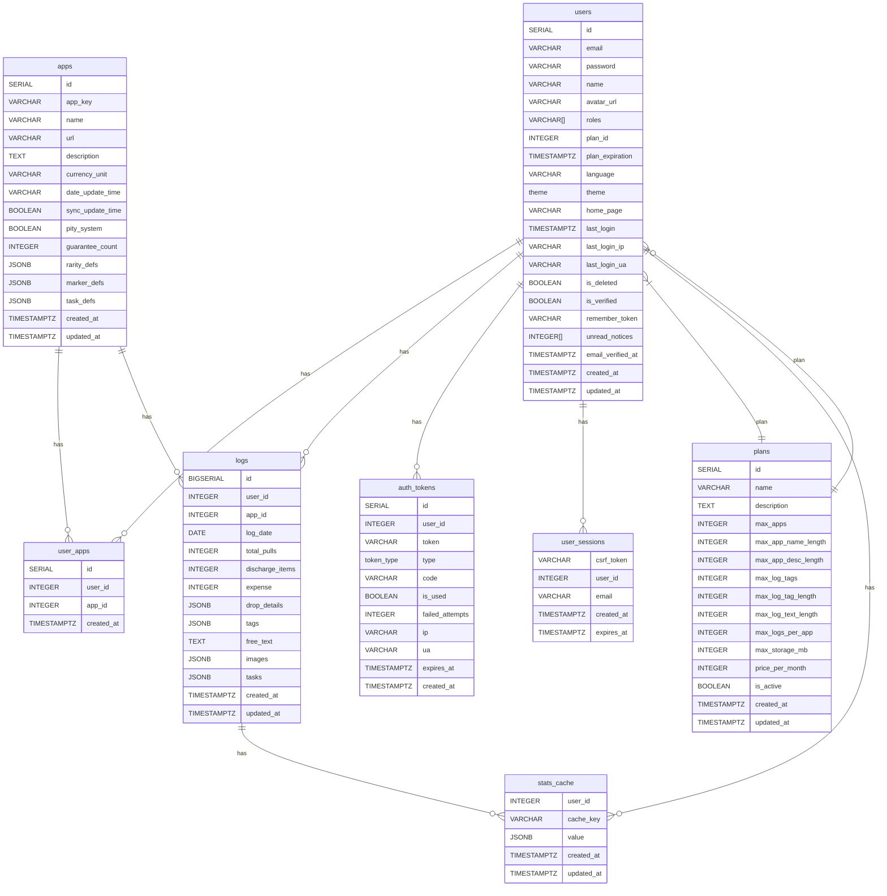
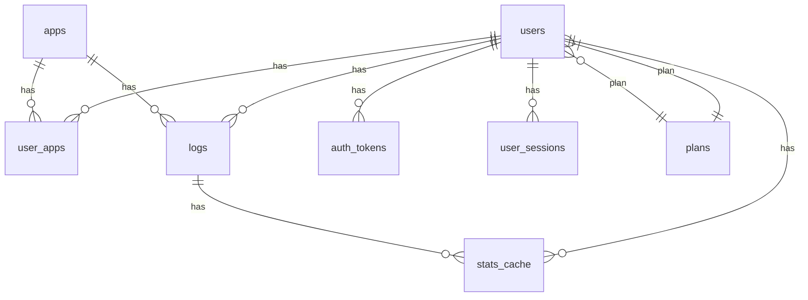

# PullLog ER

## Full-Spec

```mermaid
erDiagram
    users ||--o{ user_apps: "has"
    users {
        SERIAL id
        VARCHAR email
        VARCHAR password
        VARCHAR name
        VARCHAR avatar_url
        VARCHAR[] roles
        INTEGER plan_id
        TIMESTAMPTZ plan_expiration
        VARCHAR language
        theme theme
        VARCHAR home_page
        TIMESTAMPTZ last_login
        VARCHAR last_login_ip
        VARCHAR last_login_ua
        BOOLEAN is_deleted
        BOOLEAN is_verified
        VARCHAR remember_token
        INTEGER[] unread_notices
        TIMESTAMPTZ email_verified_at
        TIMESTAMPTZ created_at
        TIMESTAMPTZ updated_at
    }
    user_apps {
        SERIAL id
        INTEGER user_id
        INTEGER app_id
        TIMESTAMPTZ created_at
    }
    users ||--o{ logs: "has"
    logs {
        BIGSERIAL id
        INTEGER user_id
        INTEGER app_id
        DATE log_date
        INTEGER total_pulls
        INTEGER discharge_items
        INTEGER expense
        JSONB drop_details
        JSONB tags
        TEXT free_text
        JSONB images
        JSONB tasks
        TIMESTAMPTZ created_at
        TIMESTAMPTZ updated_at
    }
    users ||--o{ auth_tokens: "has"
    auth_tokens {
        SERIAL id
        INTEGER user_id
        VARCHAR token
        token_type type
        VARCHAR code
        BOOLEAN is_used
        INTEGER failed_attempts
        VARCHAR ip
        VARCHAR ua
        TIMESTAMPTZ expires_at
        TIMESTAMPTZ created_at
    }
    users ||--o{ user_sessions: "has"
    user_sessions {
        VARCHAR csrf_token
        INTEGER user_id
        VARCHAR email
        TIMESTAMPTZ created_at
        TIMESTAMPTZ expires_at
    }
    users }|--|| plans: "plan"
    plans ||--o{ users: "plan"
    plans {
        SERIAL id
        VARCHAR name
        TEXT description
        INTEGER max_apps
        INTEGER max_app_name_length
        INTEGER max_app_desc_length
        INTEGER max_log_tags
        INTEGER max_log_tag_length
        INTEGER max_log_text_length
        INTEGER max_logs_per_app
        INTEGER max_storage_mb
        INTEGER price_per_month
        BOOLEAN is_active
        TIMESTAMPTZ created_at
        TIMESTAMPTZ updated_at
    }
    apps ||--o{ user_apps: "has"
    apps {
        SERIAL id
        VARCHAR app_key
        VARCHAR name
        VARCHAR url
        TEXT description
        VARCHAR currency_unit
        VARCHAR date_update_time
        BOOLEAN sync_update_time
        BOOLEAN pity_system
        INTEGER guarantee_count
        JSONB rarity_defs
        JSONB marker_defs
        JSONB task_defs
        TIMESTAMPTZ created_at
        TIMESTAMPTZ updated_at
    }
    apps ||--o{ logs: "has"
    logs ||--o{ stats_cache: "has"
    users ||--o{ stats_cache: "has"
    stats_cache {
        INTEGER user_id
        VARCHAR cache_key
        JSONB value
        TIMESTAMPTZ created_at
        TIMESTAMPTZ updated_at
    }
```

## Summary

```mermaid
erDiagram
    users      ||--o{ user_apps: "has"
    users      ||--o{ logs: "has"
    users      ||--o{ auth_tokens: "has"
    users      ||--o{ user_sessions: "has"
    users      ||--o{ stats_cache: "has"
    users      }|--|| plans: "plan"
    apps       ||--o{ user_apps: "has"
    apps       ||--o{ logs: "has"
    logs       ||--o{ stats_cache: "has"
    plans      ||--o{ users: "plan"
```
