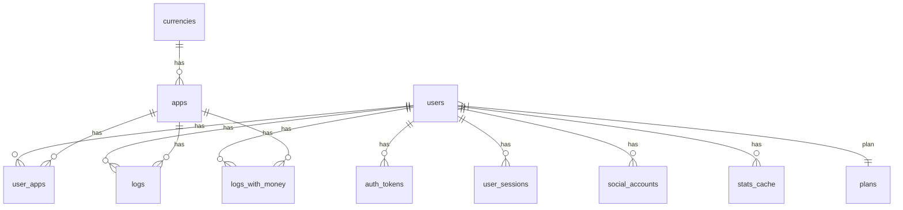

# PullLog ER

## Full-Spec

```mermaid
%% Mermaid ER (PostgreSQL oriented)
erDiagram
    %% =======================
    %% Users
    %% =======================
    users ||--o{ user_apps: "has"
    users ||--o{ logs: "has"
    users ||--o{ auth_tokens: "has"
    users ||--o{ user_sessions: "has"
    users ||--o{ social_accounts: "has"
    users ||--o{ stats_cache: "has"
    users }|--|| plans: "belongs to"

    users {
        SERIAL       id
        VARCHAR      email
        VARCHAR      password
        VARCHAR      name
        VARCHAR      avatar_url
        VARCHAR[]    roles
        INTEGER      plan_id
        TIMESTAMPTZ  plan_expiration
        VARCHAR      language
        theme        theme
        VARCHAR      home_page
        TIMESTAMPTZ  last_login
        VARCHAR      last_login_ip
        VARCHAR      last_login_ua
        BOOLEAN      is_deleted
        BOOLEAN      is_verified
        VARCHAR      remember_token
        INTEGER[]    unread_notices
        TIMESTAMPTZ  email_verified_at
        TIMESTAMPTZ  created_at
        TIMESTAMPTZ  updated_at
    }

    %% =======================
    %% Plans
    %% =======================
    plans ||--o{ users: "has"
    plans {
        SERIAL       id
        VARCHAR      name
        TEXT         description
        INTEGER      max_apps
        INTEGER      max_app_name_length
        INTEGER      max_app_desc_length
        INTEGER      max_log_tags
        INTEGER      max_log_tag_length
        INTEGER      max_log_text_length
        INTEGER      max_logs_per_app
        INTEGER      max_storage_mb
        INTEGER      price_per_month
        BOOLEAN      is_active
        TIMESTAMPTZ  created_at
        TIMESTAMPTZ  updated_at
    }

    %% =======================
    %% Currencies
    %% =======================
    currencies ||--o{ apps: "has"
    currencies {
        CHAR(3)      code
        VARCHAR      name
        VARCHAR      symbol
        VARCHAR      symbol_native
        SMALLINT     minor_unit
        NUMERIC      rounding
        VARCHAR      name_plural
        TIMESTAMPTZ  created_at
        TIMESTAMPTZ  updated_at
    }

    %% =======================
    %% Apps
    %% =======================
    apps ||--o{ user_apps: "has"
    apps ||--o{ logs: "has"
    apps {
        SERIAL       id
        VARCHAR(64)  app_key
        VARCHAR(128) name
        VARCHAR(255) url
        TEXT         description
        CHAR(3)      currency_code  %% FK -> currencies.code
        VARCHAR(5)   date_update_time
        BOOLEAN      sync_update_time
        BOOLEAN      pity_system
        INTEGER      guarantee_count
        JSONB        rarity_defs
        JSONB        marker_defs
        JSONB        task_defs
        TIMESTAMPTZ  created_at
        TIMESTAMPTZ  updated_at
    }

    %% =======================
    %% Pivot: user_apps
    %% =======================
    user_apps {
        SERIAL       id
        INTEGER      user_id  %% FK -> users.id
        INTEGER      app_id   %% FK -> apps.id
        TIMESTAMPTZ  created_at
        TIMESTAMPTZ  updated_at
        %% UNIQUE (user_id, app_id) 推奨
    }

    %% =======================
    %% Logs (hash partitioned by user_id)
    %% =======================
    logs {
        BIGSERIAL    id
        INTEGER      user_id  %% FK -> users.id
        INTEGER      app_id   %% FK -> apps.id
        DATE         log_date
        INTEGER      total_pulls
        INTEGER      discharge_items
        BIGINT       expense_amount   %% minor units (non-negative)
        JSONB        drop_details
        JSONB        tags
        TEXT         free_text
        JSONB        images
        JSONB        tasks
        TIMESTAMPTZ  created_at
        TIMESTAMPTZ  updated_at
        %% PRIMARY KEY (user_id, id)
        %% UNIQUE (user_id, app_id, log_date)
        %% PARTITION BY HASH (user_id)
    }

    %% =======================
    %% View: logs_with_money (read-only)
    %% =======================
    users ||--o{ logs_with_money: "has"
    apps  ||--o{ logs_with_money: "has"
    logs_with_money {
        BIGINT       id             %% from logs.id
        INTEGER      user_id
        INTEGER      app_id
        DATE         log_date
        INTEGER      total_pulls
        INTEGER      discharge_items
        BIGINT       expense_amount
        CHAR(3)      currency_code
        SMALLINT     minor_unit
        NUMERIC      expense_decimal
        JSONB        drop_details
        JSONB        tags
        TEXT         free_text
        JSONB        images
        JSONB        tasks
        TIMESTAMPTZ  created_at
        TIMESTAMPTZ  updated_at
        %% VIEW: logs JOIN apps JOIN currencies
    }

    %% =======================
    %% Auth tokens
    %% =======================
    auth_tokens {
        SERIAL       id
        INTEGER      user_id     %% FK -> users.id
        VARCHAR      token
        token_type   type
        VARCHAR      code
        BOOLEAN      is_used
        INTEGER      failed_attempts
        VARCHAR      ip
        VARCHAR      ua
        TIMESTAMPTZ  expires_at
        TIMESTAMPTZ  created_at
    }

    %% =======================
    %% User sessions
    %% =======================
    user_sessions {
        VARCHAR      csrf_token   %% PK
        INTEGER      user_id      %% FK -> users.id
        VARCHAR      email
        TIMESTAMPTZ  created_at
        TIMESTAMPTZ  expires_at
    }

    %% =======================
    %% Social accounts
    %% =======================
    social_accounts {
        SERIAL       id
        INTEGER      user_id      %% FK -> users.id
        VARCHAR      provider
        VARCHAR      provider_user_id
        VARCHAR      provider_email
        VARCHAR      avatar_url
        TEXT         access_token     %% encrypted cast
        TEXT         refresh_token    %% encrypted cast
        TIMESTAMPTZ  token_expires_at
        TIMESTAMPTZ  created_at
        TIMESTAMPTZ  updated_at
    }

    %% =======================
    %% Stats cache (per user or global when user_id NULL)
    %% =======================
    stats_cache {
        INTEGER      user_id      %% FK -> users.id (nullable)
        VARCHAR      cache_key    %% PK
        JSONB        value
        TIMESTAMPTZ  created_at
        TIMESTAMPTZ  updated_at
    }
```

## Summary


